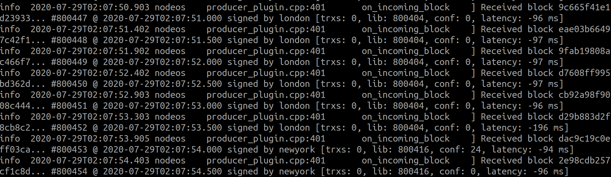
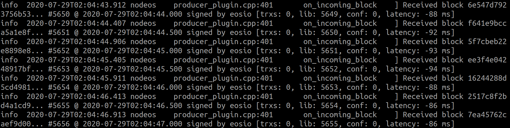

# Consortium Walkthrough

- [Consortium Walkthrough](#consortium-walkthrough)
	- [Prerequisites](#prerequisites)
	- [Tips for scripts](#tips-for-scripts)
	- [1. The use of root Certificate Authority (CA) to issue certificates for nodes and clients (below is for local test and it is not recommended for security reasons)](#1-the-use-of-root-certificate-authority-ca-to-issue-certificates-for-nodes-and-clients-below-is-for-local-test-and-it-is-not-recommended-for-security-reasons)
	- [[Recommended] 1. CA Hierarchy (suitable for real organization needs and more secure)](#recommended-1-ca-hierarchy-suitable-for-real-organization-needs-and-more-secure)
		- [(1) Generate root CA and secondary CA certificates](#1-generate-root-ca-and-secondary-ca-certificates)
		- [(2) Use a secondary CA to issue certificates to nodes or clients](#2-use-a-secondary-ca-to-issue-certificates-to-nodes-or-clients)
		- [(3)Execute the script](#3execute-the-script)
	- [2. Certificate configuration - Related to Https](#2-certificate-configuration---related-to-https)
		- [Node nodeos](#node-nodeos)
		- [Client cleos](#client-cleos)
	- [3. Certificate configuration - Related to P2P](#3-certificate-configuration---related-to-p2p)
		- [Node nodeos (P2P over TLS)](#node-nodeos-p2p-over-tls)
		- [latency test](#latency-test)
	- [4. Certification Revocation list (CRL) Management](#4-certification-revocation-list-crl-management)
		- [Deploy the CA contract](#deploy-the-ca-contract)
		- [Add/delete a client's public key hash (to the CRL contract)](#adddelete-a-clients-public-key-hash-to-the-crl-contract)

## Prerequisites

`OpenSSL 1.1.1`

## Tips for scripts 

- Use OpenSSL to generate `X509` Certificate
- The public-key cryptography used in OpenSSL is `ECC - secp384r1`

## 1. The use of root Certificate Authority (CA) to issue certificates for nodes and clients (below is only for local test and it is not recommended for security reasons)

```sh
# The method of CA certificate and key generation----directly generate CA key and its self-signed certificate (3650 days validity)
openssl req -newkey ec:<(openssl ecparam -name secp384r1) -nodes -keyout ca-prikey.pem -x509 -days 3650 -out ca-cert.pem -subj "/C=CN/ST=shanghai/L=shanghai/O=XENIRO/OU=Snapscale/CN=Root CA/emailAddress=ryan.wu@xeniro.io"

# The method of node certificate and key generation----directly generate the node key and certificate to be signed
# Note: CN must write the IP address of the node (local test 127.0.0.1) or domain name
openssl req -newkey ec:<(openssl ecparam -name secp384r1) -nodes -keyout node-prikey.pem  -out node-req.csr -subj "/C=CN/ST=shanghai/L=shanghai/O=XENIRO/OU=Snapscale/CN=127.0.0.1/emailAddress=ryan.wu@xeniro.io"

# Use the CA certificate and key to sign the node certificate (3650 days validity):

openssl x509 -req -days 3650 -in node-req.csr -CA ca-cert.pem -CAkey ca-prikey.pem -CAcreateserial -out node-cert.pem

# The method of client certificate and key generation---- directly generate the client key and certificate to be signed
# CN could be the account name on the platform or consortium
openssl req -newkey ec:<(openssl ecparam -name secp384r1) -nodes -keyout client-prikey.pem -out client-req.csr -subj "/C=CN/ST=shanghai/L=shanghai/O=XENIRO/OU=Snapscale/CN=CLIENT/emailAddress=ryan.wu@xeniro.io"

# Use CA certificate and key to sign the client certificate (3650 days validity):
openssl x509 -req -days 3650 -in client-req.csr -CA ca-cert.pem -CAkey ca-prikey.pem -CAcreateserial -out client-cert.pem
```

## [Recommended] 1. CA Hierarchy (suitable for real organization needs and more secure)

### (1) Generate root CA and secondary CA certificates

Prepare configuration files: `rootCA.conf`

```ini
[ ca ]
default_ca = the_ca
[ the_ca ]
dir = ./rootCA
private_key = $dir/private/rootCA.key
certificate = $dir/rootCA.crt
new_certs_dir = $dir/certs
serial = $dir/db/crt.srl
database = $dir/db/db
default_md = sha256
policy = policy_any
email_in_dn = no
[ policy_any ]
domainComponent = optional
countryName = optional
stateOrProvinceName = optional
localityName = optional
organizationName = optional
organizationalUnitName = optional
commonName = optional
emailAddress = optional
[ ca_ext ]
keyUsage                = critical,keyCertSign,cRLSign
basicConstraints        = critical,CA:true
subjectKeyIdentifier    = hash
authorityKeyIdentifier  = keyid:always
```

Prepare configuration files: `CA-csr.conf`

```ini
[ req ]
encrypt_key = no
default_bits = 2048
default_md = sha256
utf8 = yes
string_mask = utf8only
prompt = no
distinguished_name = ca_dn
[ ca_dn ]
0.organizationName = "XENIRO"
organizationalUnitName = "Snapscale-OBS"
commonName = "CA"
```

Prepare script files: `1.generate.sh`

```sh
# Prepare a directory for the root CA

mkdir rootCA
mkdir rootCA/{certs,db,private}
chmod 700 rootCA/private
touch rootCA/db/db
touch rootCA/db/db.attr

openssl req -newkey ec:<(openssl ecparam -name secp384r1) -nodes -keyout rootCA/private/rootCA.key -x509 -days 36500 -out rootCA/rootCA.crt -subj "/C=CN/ST=shanghai/L=shanghai/O=XENIRO/OU=Snapscale/CN=Root CA/emailAddress=ryan.wu@xeniro.io"

# Prepare a directory for the intermediate CA, where the private key of the CA certificate is stored.
mkdir CA
mkdir CA/{certs,db,private}
chmod 700 CA/private
touch CA/db/db
touch CA/db/db.attr

openssl req -newkey ec:<(openssl ecparam -name secp384r1) -config CA-csr.conf -out CA.csr -keyout CA/private/CA.key

#  sign the certificate in the request with the root certificate:
openssl ca -config rootCA.conf -days 7650 -create_serial \
    -in CA.csr -out CA/CA.crt -extensions ca_ext -notext

# Link certificates together to have the certificate chain in one file:
cat CA/CA.crt rootCA/rootCA.crt >CA/CA.pem
```

### (2) Use a secondary CA to issue certificates to nodes or clients

Prepare script files: `~/Desktop/temp/ca/1.generate.sh`

```sh
# The method of node certificate and key generation----directly generate node key and certificate to be signed
# Note: CN must write the IP address of the node (local test 127.0.0.1) or domain name
openssl req -newkey ec:<(openssl ecparam -name secp384r1) -nodes -keyout node-prikey.pem  -out node-req.csr -subj "/C=CN/ST=shanghai/L=shanghai/O=XENIRO/OU=Snapscale/CN=127.0.0.1/emailAddress=ryan.wu@xeniro.io"

# Use the CA certificate and key to sign the node certificate (3650 days validity):
openssl x509 -req -days 3650 -in node-req.csr -CA ca-cert.pem -CAkey ca-prikey.pem -CAcreateserial -out node-cert.pem.tmp

# Certificate aggregation（Note: pay attention to the certificate order）
# Since it is a certificate issued by a secondary CA, the node needs to send the root CA, secondary CA and other certificates in order to the browser. Thus, the web (client) node receives an aggregated certificate.
cat node-cert.pem.tmp ca-cert.pem | tee node-cert.pem

# -------------------------------

# The method of client certificate and key generation----directly generate client key and certificate to be signed
# CN could be the account name on the platform or consortium
openssl req -newkey ec:<(openssl ecparam -name secp384r1) -nodes -keyout client-prikey.pem -out client-req.csr -subj "/C=CN/ST=shanghai/L=shanghai/O=XENIRO/OU=Snapscale/CN=CLIENT/emailAddress=ryan.wu@xeniro.io"

# Use CA certificate and key to sign the client certificate (3650 days validity):
openssl x509 -req -days 3650 -in client-req.csr -CA ca-cert.pem -CAkey ca-prikey.pem -CAcreateserial -out client-cert.pem.tmp

# Certificate aggregation（Note: pay attention to the certificate order）
cat client-cert.pem.tmp ca-cert.pem | tee client-cert.pem
```

### (3)Execute the script

```sh
# If you regenerate the secondary certificate, you can delete the following two directories
rm -r rootCA
rm -r CA

source 1.generate.sh

# Copy the generated secondary certificate and keys (the secondary certificates cannot issue subordinate certificates)
cp CA/CA.pem ~/Desktop/temp/ca/ca-cert.pem
cp CA/private/CA.key ~/Desktop/temp/ca/ca-prikey.pem
cp rootCA/rootCA.crt ~/Desktop/temp/ca/root-ca-cert.pem

cd ~/Desktop/temp/ca
source 1.generate.sh
```

## 2. Certificate configuration - Related to Https

### Node nodeos

Configure in the Node nodeos config file

```ini
## The local IP and port to listen for incoming https connections; leave blank to disable. (eosio::http_plugin)
https-server-address = 127.0.0.1:8443

## Filename with the certificate chain to present on https connections. PEM format. Required for https. (eosio::http_plugin)
https-certificate-chain-file = ./ca/node-cert.pem

## Filename with https private key in PEM format. Required for https (eosio::http_plugin)
https-private-key-file = ./ca/node-prikey.pem

##add one trusted certification authority
https-root-cert-file = ./ca/ca-cert.pem

##Configure https ECDH curve to use: secp384r1(默认) or prime256v1(即secp256r1)
#https-ecdh-curve = secp384r1
```

- Enable Https API function
- Add trusted root certificates
- Enable mutual authentication
- Switch
  - Verify the clients' certificate when using HTTPS (default) `no-verify = false`
  - Not to verify the clients' certificate when using HTTPS `no-verify = true`

### Client cleos

- Add trusted root certificates
- Configure the client's TLS certificate and private key
- Switch
  - Verify the clients' certificate when using HTTPS (default) `--no-verify=false`
  - Not to verify the clients' certificate when using HTTPS `--no-verify=true`

Add startup parameters when the client cleos starts

```sh
--https-root-cert-file=./ca/ca-cert.pem
--https-certificate-chain-file=./ca/client-cert.pem
--https-private-key-file=./ca/client-prikey.pem
```

Use case
  
```sh
./cleos -u https://127.0.0.1:8443 \
 --https-root-cert-file=./ca/ca-cert.pem \
 --https-certificate-chain-file=./ca/client-cert.pem \
 --https-private-key-file=./ca/client-prikey.pem \
 get info
```

## 3. Certificate configuration - Related to P2P

### Node nodeos (P2P over TLS)

Configure in the Node nodeos config file

```ini
tls-enable=true  #The default parameters is false
nodes-root-cert-file=./config/cert/ca-cert.pem  #Support relative path
nodes-certificate-chain-file=./config/cert/node-cert.pem
nodes-private-key-file=./config/cert/node-prikey.pem
```

> Note：When tls-enable = false ，there is no need to configure related parameters`nodes-root-cert-file`\`nodes-certificate-chain-file`\`nodes-private-key-file`

### latency test

- The image belwo shows the synchronization latency between the two nodes of the intranet K8S before P2P adds TLS
  
  

- The image belwo shows the synchronization latency between the two local nodes after P2P adds TLS

  

- It seems that the adding of TLS has little effect on the efficiency of synchronization between nodes

## 4. Certification Revocation list (CRL) Management

### Deploy the CA contract

```sh
cleos wallet import --private-key 5KF5jtD8QGKpypuT3HLDYjDiVTzrLvkYiEb2XXtxwabty87m9ib

cleos create account eosio xst.ca XST71cZdtoJbJyC89sTpUCa14nMCKMv95QzWSZdUKo9FcbusJxy9A

cleos  transfer  eosio  xst.ca  "10000.0000 XST"  -p  eosio

cleos set contract xst.ca ../../unittests/contracts/xst.ca -p xst.ca
```

### Add/delete a client's public key hash (to the CRL contract)

```sh
# Extract the client's public key file from the client certificate
openssl x509 -in ca/client-cert.pem -pubkey  -noout > ca/client-pubkey.pem

# hash
sha256sum ca/client-pubkey.pem
  #79fc3ca87dac873243c8955e67ef5b29116517dd64f4d866010af30decd7b63d

#Add CRL
cleos push action xst.ca addcrl '{"pk_hash":"79fc3ca87dac873243c8955e67ef5b29116517dd64f4d866010af30decd7b63d"}' -p xst.ca@active

#Delete CRL
cleos push action xst.ca delcrl '{"pk_hash":"79fc3ca87dac873243c8955e67ef5b29116517dd64f4d866010af30decd7b63d"}' -p xst.ca@active

#Check
cleos get table xst.ca xst.ca crls
```
