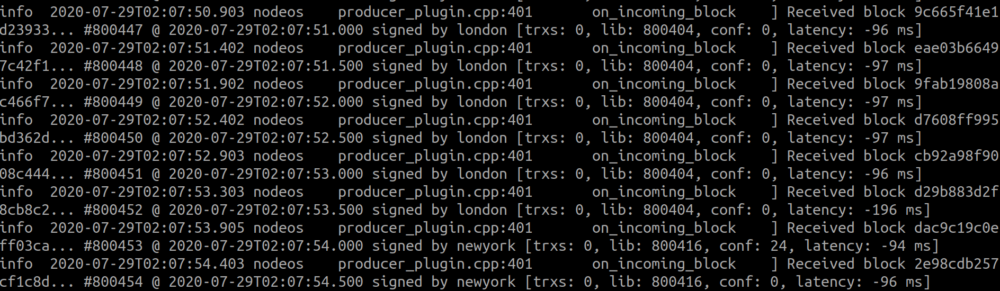
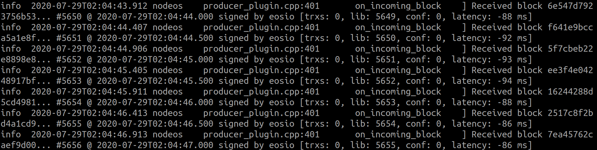

# Consortium Walkthrough

- [Consortium Walkthrough](#consortium-walkthrough)
	- [Prerequisites](#prerequisites)
	- [关于下文中用到的脚本的小提示](#关于下文中用到的脚本的小提示)
	- [一. 用根CA为节点和客户端颁发证书 (本地测试用, 不够安全)](#一-用根ca为节点和客户端颁发证书-本地测试用-不够安全)
	- [[推荐] 一. 分层CA (适合生产环境, 更安全)](#推荐-一-分层ca-适合生产环境-更安全)
		- [(1)生成根CA和二级CA证书](#1生成根ca和二级ca证书)
		- [(2)使用二级CA给节点或者客户端颁发证书](#2使用二级ca给节点或者客户端颁发证书)
		- [(3)执行脚本](#3执行脚本)
	- [二. 证书配置 - Https相关](#二-证书配置---https相关)
		- [节点 nodeos](#节点-nodeos)
		- [客户端 cleos](#客户端-cleos)
	- [三. 证书配置 - P2P相关](#三-证书配置---p2p相关)
		- [节点 nodeos (P2P over TLS)](#节点-nodeos-p2p-over-tls)
		- [latency测试](#latency测试)
	- [四. CRL管理](#四-crl管理)
		- [部署CA合约](#部署ca合约)
		- [往CRL合约中加入/删除某个客户端的公钥hash值](#往crl合约中加入删除某个客户端的公钥hash值)

## Prerequisites

`OpenSSL 1.1.1`

## 关于下文中用到的脚本的小提示

- 在命令行中使用OpenSSL, 生成 `X.509` 证书
- OpenSSL中的密钥算法选用 `ECC - secp384r1`

## 一. 用根CA为节点和客户端颁发证书 (本地测试用, 不够安全)

```sh
# CA证书及密钥生成方法----直接生成CA密钥及其自签名证书(有效期3650天)
openssl req -newkey ec:<(openssl ecparam -name secp384r1) -nodes -keyout ca-prikey.pem -x509 -days 3650 -out ca-cert.pem -subj "/C=CN/ST=shanghai/L=shanghai/O=XENIRO/OU=Snapscale/CN=Root CA/emailAddress=ryan.wu@xeniro.io"

# 节点证书及密钥生成方法----直接生成节点密钥及待签名证书
# 注意: CN 一定要写节点所在的ip地址(本地测试用 本地测试127.0.0.1)或域名
openssl req -newkey ec:<(openssl ecparam -name secp384r1) -nodes -keyout node-prikey.pem  -out node-req.csr -subj "/C=CN/ST=shanghai/L=shanghai/O=XENIRO/OU=Snapscale/CN=127.0.0.1/emailAddress=ryan.wu@xeniro.io"

# 使用CA证书及密钥对节点证书进行签名(有效期3650天)：
openssl x509 -req -days 3650 -in node-req.csr -CA ca-cert.pem -CAkey ca-prikey.pem -CAcreateserial -out node-cert.pem

# 客户端证书及密钥生成方法----直接生成客户端密钥及待签名证书
# CN  可以填平台账户名或链上账户名
openssl req -newkey ec:<(openssl ecparam -name secp384r1) -nodes -keyout client-prikey.pem -out client-req.csr -subj "/C=CN/ST=shanghai/L=shanghai/O=XENIRO/OU=Snapscale/CN=CLIENT/emailAddress=ryan.wu@xeniro.io"

# 使用CA证书及密钥对客户端证书进行签名(有效期3650天)：
openssl x509 -req -days 3650 -in client-req.csr -CA ca-cert.pem -CAkey ca-prikey.pem -CAcreateserial -out client-cert.pem
```

## [推荐] 一. 分层CA (适合生产环境, 更安全)

### (1)生成根CA和二级CA证书

准备配置文件 `rootCA.conf`

```ini
[ ca ]
default_ca = the_ca
[ the_ca ]
dir = ./rootCA
private_key = $dir/private/rootCA.key
certificate = $dir/rootCA.crt
new_certs_dir = $dir/certs
serial = $dir/db/crt.srl
database = $dir/db/db
default_md = sha256
policy = policy_any
email_in_dn = no
[ policy_any ]
domainComponent = optional
countryName = optional
stateOrProvinceName = optional
localityName = optional
organizationName = optional
organizationalUnitName = optional
commonName = optional
emailAddress = optional
[ ca_ext ]
keyUsage                = critical,keyCertSign,cRLSign
basicConstraints        = critical,CA:true
subjectKeyIdentifier    = hash
authorityKeyIdentifier  = keyid:always
```

准备配置文件 `CA-csr.conf`

```ini
[ req ]
encrypt_key = no
default_bits = 2048
default_md = sha256
utf8 = yes
string_mask = utf8only
prompt = no
distinguished_name = ca_dn
[ ca_dn ]
0.organizationName = "XENIRO"
organizationalUnitName = "Snapscale-OBS"
commonName = "CA"
```

准备脚本文件 `1.generate.sh`

```sh
# Prepare a directory for the root CA

mkdir rootCA
mkdir rootCA/{certs,db,private}
chmod 700 rootCA/private
touch rootCA/db/db
touch rootCA/db/db.attr

openssl req -newkey ec:<(openssl ecparam -name secp384r1) -nodes -keyout rootCA/private/rootCA.key -x509 -days 36500 -out rootCA/rootCA.crt -subj "/C=CN/ST=shanghai/L=shanghai/O=XENIRO/OU=Snapscale/CN=Root CA/emailAddress=ryan.wu@xeniro.io"

# Prepare a directory for the intermediate CA, where the private key of the CA certificate is stored.
mkdir CA
mkdir CA/{certs,db,private}
chmod 700 CA/private
touch CA/db/db
touch CA/db/db.attr

openssl req -newkey ec:<(openssl ecparam -name secp384r1) -config CA-csr.conf -out CA.csr -keyout CA/private/CA.key

#  sign the certificate in the request with the root certificate:
openssl ca -config rootCA.conf -days 7650 -create_serial \
    -in CA.csr -out CA/CA.crt -extensions ca_ext -notext

# Link certificates together to have the certificate chain in one file:
cat CA/CA.crt rootCA/rootCA.crt >CA/CA.pem
```

### (2)使用二级CA给节点或者客户端颁发证书

准备脚本文件 `~/Desktop/temp/ca/1.generate.sh`

```sh
# 节点证书及密钥生成方法----直接生成节点密钥及待签名证书
# 注意: CN 一定要写节点所在的ip地址(本地测试用 本地测试127.0.0.1)或域名
openssl req -newkey ec:<(openssl ecparam -name secp384r1) -nodes -keyout node-prikey.pem  -out node-req.csr -subj "/C=CN/ST=shanghai/L=shanghai/O=XENIRO/OU=Snapscale/CN=127.0.0.1/emailAddress=ryan.wu@xeniro.io"

# 使用CA证书及密钥对节点证书进行签名(有效期3650天)：
openssl x509 -req -days 3650 -in node-req.csr -CA ca-cert.pem -CAkey ca-prikey.pem -CAcreateserial -out node-cert.pem.tmp

# 聚合证书（重要 注意顺序）
# 由于是二级CA颁发的证书，所以，节点需要把根CA、二级CA等证书都要发送给浏览器，所以给到web节点的证书是要一个聚合的证书
cat node-cert.pem.tmp ca-cert.pem | tee node-cert.pem

# -------------------------------

# 客户端证书及密钥生成方法----直接生成客户端密钥及待签名证书
# CN  可以填平台账户名或链上账户名
openssl req -newkey ec:<(openssl ecparam -name secp384r1) -nodes -keyout client-prikey.pem -out client-req.csr -subj "/C=CN/ST=shanghai/L=shanghai/O=XENIRO/OU=Snapscale/CN=CLIENT/emailAddress=ryan.wu@xeniro.io"

# 使用CA证书及密钥对客户端证书进行签名(有效期3650天)：
openssl x509 -req -days 3650 -in client-req.csr -CA ca-cert.pem -CAkey ca-prikey.pem -CAcreateserial -out client-cert.pem.tmp

# 聚合证书（重要 注意顺序）
cat client-cert.pem.tmp ca-cert.pem | tee client-cert.pem
```

### (3)执行脚本

```sh
# 如果重新生成二级证书, 可把以下两个目录删除
rm -r rootCA
rm -r CA

source 1.generate.sh

# 把生成的二级ca证书与钥匙拷贝到使用处 (二级ca证书无法再颁发下一级ca证书)
cp CA/CA.pem ~/Desktop/temp/ca/ca-cert.pem
cp CA/private/CA.key ~/Desktop/temp/ca/ca-prikey.pem
cp rootCA/rootCA.crt ~/Desktop/temp/ca/root-ca-cert.pem

cd ~/Desktop/temp/ca
source 1.generate.sh
```

## 二. 证书配置 - Https相关

### 节点 nodeos

在节点 nodeos 的config文件中配置

```ini
## The local IP and port to listen for incoming https connections; leave blank to disable. (eosio::http_plugin)
https-server-address = 127.0.0.1:8443

## Filename with the certificate chain to present on https connections. PEM format. Required for https. (eosio::http_plugin)
https-certificate-chain-file = ./ca/node-cert.pem

## Filename with https private key in PEM format. Required for https (eosio::http_plugin)
https-private-key-file = ./ca/node-prikey.pem

##add one trusted certification authority
https-root-cert-file = ./ca/ca-cert.pem

##Configure https ECDH curve to use: secp384r1(默认) or prime256v1(即secp256r1)
#https-ecdh-curve = secp384r1
```

- 启用Https的API功能
- 添加信任的根证书
- 启用双向认证
- 开关
  - 使用HTTPS时验证对端的证书(默认) `no-verify = false`
  - 使用HTTPS时不验证对端的证书 `no-verify = true`

### 客户端 cleos

- 添加信任的根证书
- 配置客户端的tls证书与私钥
- 开关
  - 使用HTTPS时验证对端的证书(默认) `--no-verify=false`
  - 使用HTTPS时不验证对端的证书 `--no-verify=true`

在客户端 cleos 启动时添加启动参数

```sh
--https-root-cert-file=./ca/ca-cert.pem
--https-certificate-chain-file=./ca/client-cert.pem
--https-private-key-file=./ca/client-prikey.pem
```

用例
  
```sh
./cleos -u https://127.0.0.1:8443 \
 --https-root-cert-file=./ca/ca-cert.pem \
 --https-certificate-chain-file=./ca/client-cert.pem \
 --https-private-key-file=./ca/client-prikey.pem \
 get info
```

## 三. 证书配置 - P2P相关

### 节点 nodeos (P2P over TLS)

在节点 nodeos 的config文件中配置

```ini
tls-enable=true  #默认参数是false
nodes-root-cert-file=./config/cert/ca-cert.pem  #支持相对路径
nodes-certificate-chain-file=./config/cert/node-cert.pem
nodes-private-key-file=./config/cert/node-prikey.pem
```

> 注：当tls-enable = false 时，相关参数`nodes-root-cert-file`\`nodes-certificate-chain-file`\`nodes-private-key-file`不需要配置

### latency测试

- P2P增加TLS前, 内网K8S两个节点间的同步latency

  

- P2P增加TLS后, 我本地两个节点间的同步latency

  

- 目前看来增加TLS后, 对节点间同步的效率影响不大

## 四. CRL管理

### 部署CA合约

```sh
cleos wallet import --private-key 5KF5jtD8QGKpypuT3HLDYjDiVTzrLvkYiEb2XXtxwabty87m9ib

cleos create account eosio xst.ca XST71cZdtoJbJyC89sTpUCa14nMCKMv95QzWSZdUKo9FcbusJxy9A

cleos  transfer  eosio  xst.ca  "10000.0000 XST"  -p  eosio

cleos set contract xst.ca ../../unittests/contracts/xst.ca -p xst.ca
```

### 往CRL合约中加入/删除某个客户端的公钥hash值

```sh
# 从客户端证书中提取出客户端的公钥文件
openssl x509 -in ca/client-cert.pem -pubkey  -noout > ca/client-pubkey.pem

# hash
sha256sum ca/client-pubkey.pem
  #79fc3ca87dac873243c8955e67ef5b29116517dd64f4d866010af30decd7b63d

#加CRL
cleos push action xst.ca addcrl '{"pk_hash":"79fc3ca87dac873243c8955e67ef5b29116517dd64f4d866010af30decd7b63d"}' -p xst.ca@active

#删CRL
cleos push action xst.ca delcrl '{"pk_hash":"79fc3ca87dac873243c8955e67ef5b29116517dd64f4d866010af30decd7b63d"}' -p xst.ca@active

#查看
cleos get table xst.ca xst.ca crls
```
